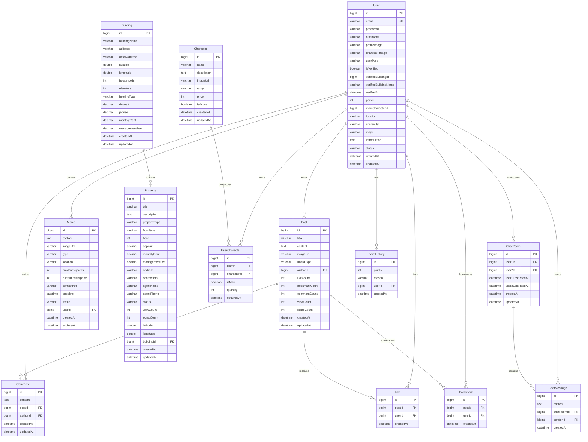
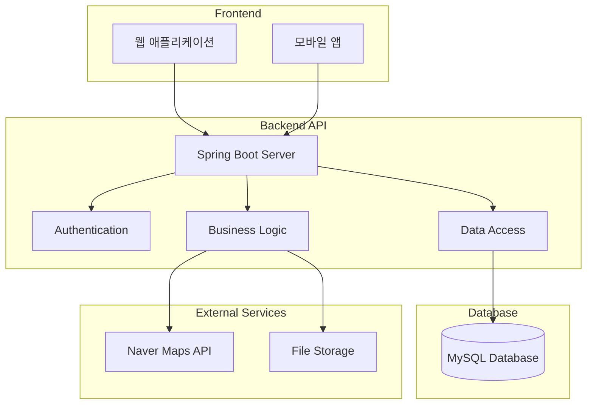
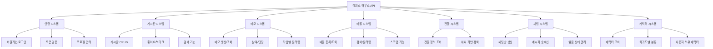
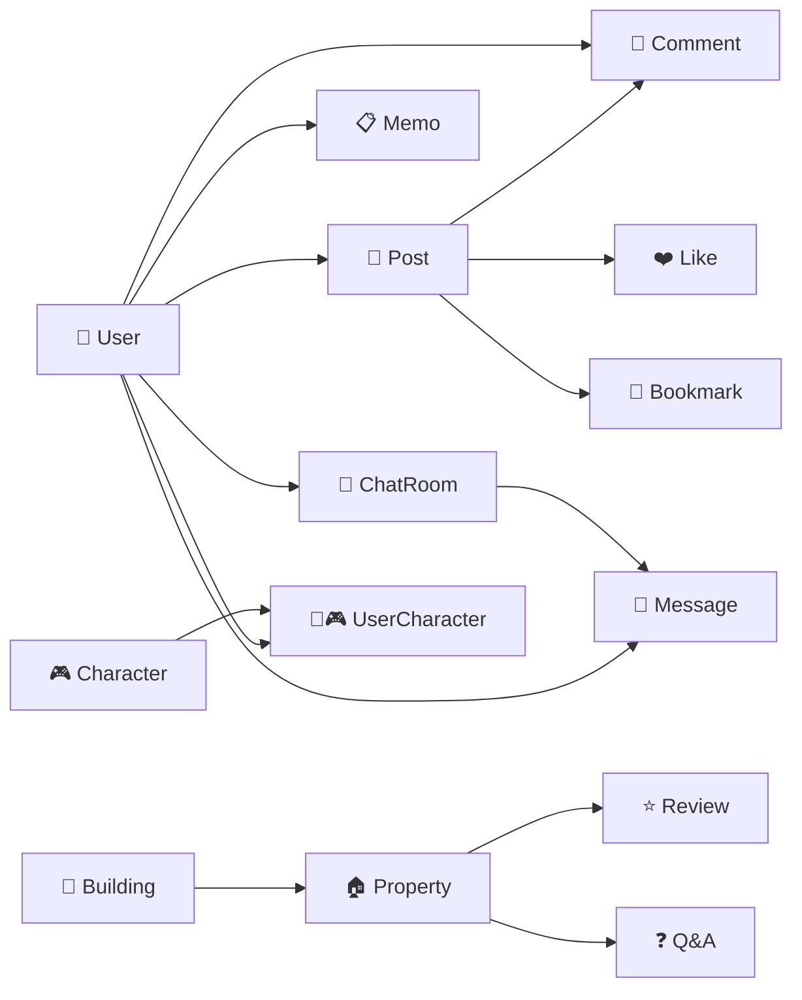

# 캠퍼스 하우스 시스템 - 엔티티 관계도

## ERD (Entity Relationship Diagram)

## 시스템 아키텍처 다이어그램

## API 엔드포인트 구조

## 간단한 엔티티 관계도

## 데이터베이스 테이블 구조

### 주요 테이블
- **users**: 사용자 정보
- **posts**: 게시글
- **comments**: 댓글
- **likes**: 좋아요
- **bookmarks**: 북마크
- **memos**: 메모
- **buildings**: 건물 정보
- **properties**: 매물 정보
- **characters**: 캐릭터 정보
- **user_characters**: 사용자 캐릭터 보유
- **chat_rooms**: 채팅방
- **chat_messages**: 채팅 메시지
- **point_histories**: 포인트 내역

### 인덱스 최적화
- **users.email**: UNIQUE INDEX
- **users.nickname**: UNIQUE INDEX
- **posts.author_id**: INDEX
- **posts.board_type**: INDEX
- **properties.building_id**: INDEX
- **properties.latitude, longitude**: SPATIAL INDEX
- **chat_rooms.user1_id, user2_id**: INDEX
